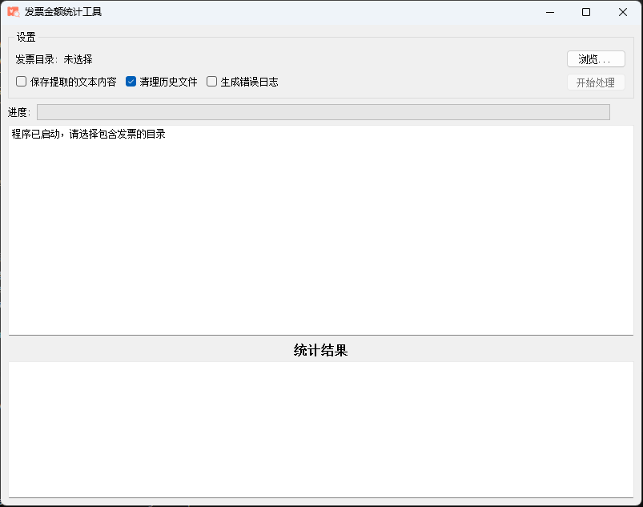

# 发票金额统计工具

一个用于自动提取PDF发票中金额并汇总的工具。使用PyQt5开发的图形界面应用程序，支持批量处理多个发票文件。

## 界面预览



## 功能特点

- 批量扫描PDF发票文件夹及子文件夹
- 自动识别并提取发票中的金额信息
- 汇总统计发票总金额
- 支持PDF发票格式
- 生成处理失败的发票列表
- 可选保存提取的原始文本，便于调试
- 错误日志记录功能

## 环境要求

- Python 3.6+
- PyQt5
- pdfplumber

## 安装方法

### 方法一：直接使用可执行文件（推荐）

1. 从[发布页面](https://github.com/yourusername/fapiao/releases)下载最新版本的`发票金额统计工具.zip`
2. 直接双击运行即可使用，无需安装Python环境

### 方法二：从源代码运行

1. 确保已安装Python 3.6或更高版本
2. 克隆或下载本项目代码
3. 安装依赖库：
   ```
   pip install -r requirements.txt
   ```
4. 运行程序：
   ```
   python fapiao_gui.py
   ```

## 使用方法

1. 打开程序后，点击"浏览..."按钮选择包含PDF发票的文件夹
2. 根据需要选择以下选项：
   - 保存提取的文本内容：将从PDF中提取的原始文本保存为TXT文件
   - 清理历史文件：在处理前清理之前的日志和输出文件
   - 生成错误日志：记录处理过程中的错误到日志文件
3. 点击"开始处理"按钮开始扫描和处理发票
4. 处理完成后，程序将显示：
   - 处理的发票总数
   - 成功识别的发票数量
   - 识别失败的发票数量
   - 所有发票的总金额

## 构建可执行文件

如果您想自己构建可执行文件，项目提供了便捷的批处理脚本：

1. 确保已安装PyInstaller：
   ```
   pip install pyinstaller
   ```
2. 运行项目目录中的`build_exe.bat`
3. 构建完成后，可执行文件位于`dist`目录

## 常见问题

**Q: 为什么有些发票无法识别金额？**  
A: 发票格式多样化，程序可能无法识别非标准格式。可以尝试启用"保存提取的文本内容"选项，分析提取的文本内容，以便改进识别算法。

**Q: 程序支持哪些类型的发票？**  
A: 主要支持中国大陆的增值税专用发票、普通发票等常见PDF格式发票。

**Q: 如何解决中文路径问题？**  
A: 程序已针对中文路径做了处理，如果仍有问题，建议将发票放在不含中文字符的路径下处理。

## 开源协议

本项目采用MIT许可证开源。 